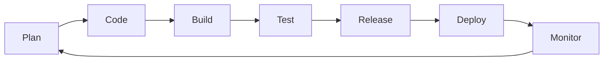
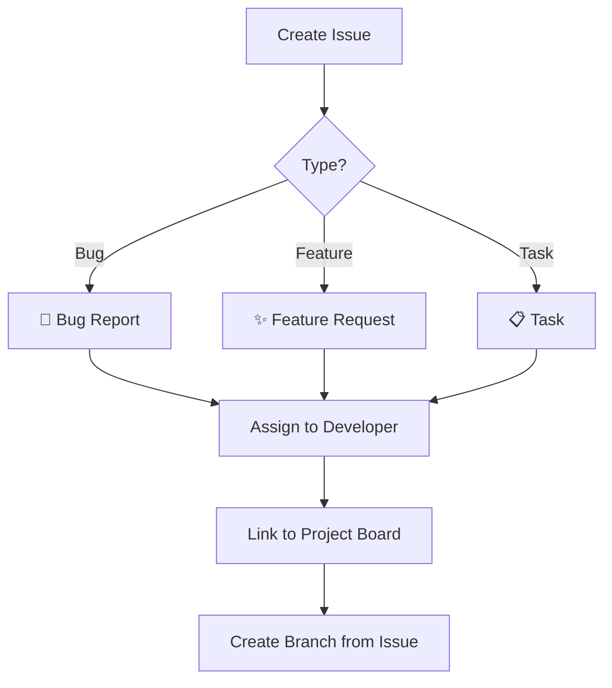
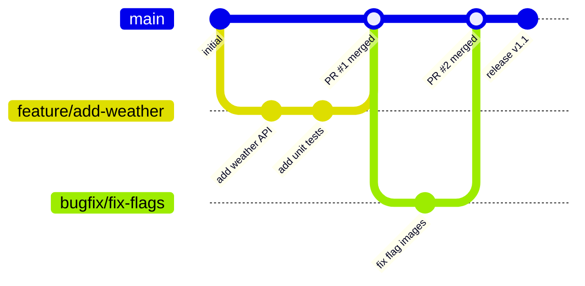
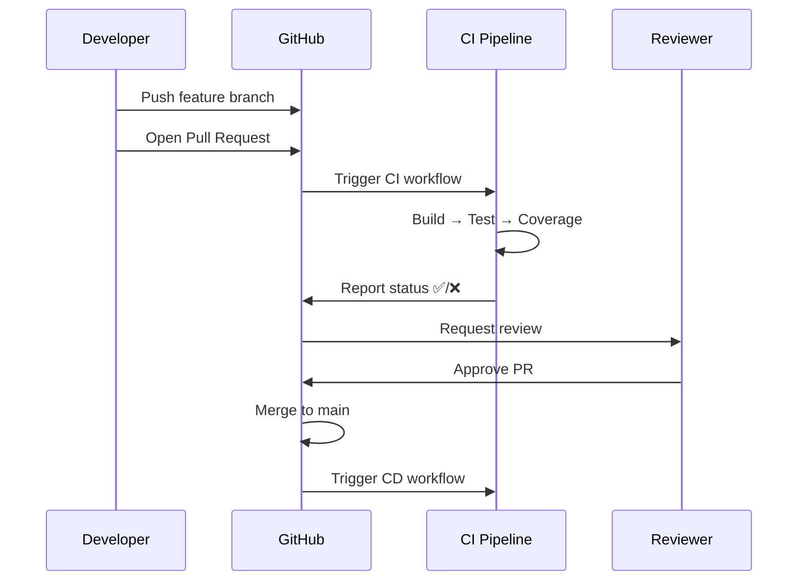
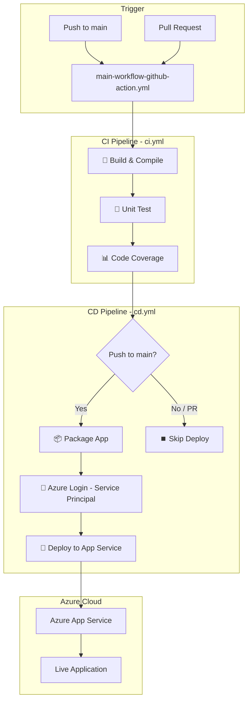
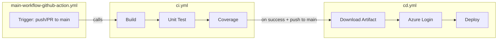
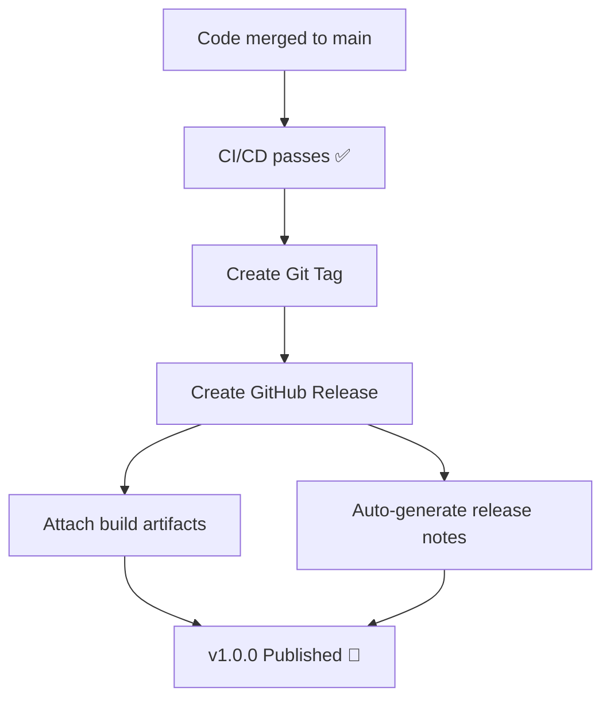
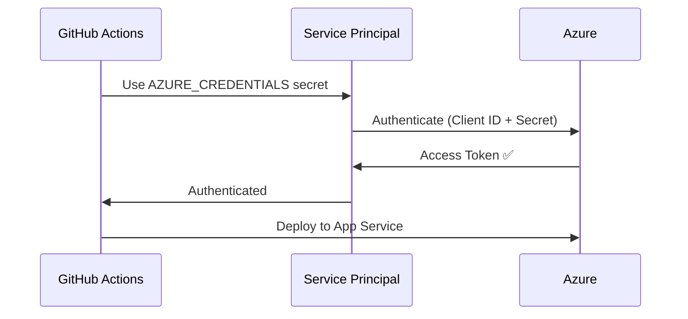

# AZ-2008-May-26-2026


## AZ-2008 DevOps Foundation

A Node.js Express web application that displays live world clocks and weather forecasts for Australia, Thailand, Japan, and India — built as a hands-on project for learning DevOps practices with GitHub and Azure.

---

## About the Project

This is a simple Express.js web app with Bootstrap that:
- Displays real-time clocks for multiple countries
- Fetches 5-day weather forecasts from **Azure Maps API**
- Shows weather icons and a hover popout for detailed forecasts

The real focus of this project is the **DevOps workflow** — how we use GitHub features and automation to build, test, and deliver software.

---

## Quick Setup

```bash
# Clone the repo
git clone https://github.com/msftnutta/AZ-2008-May-26-2026.git
cd AZ-2008-May-26-2026

# Install dependencies
npm install

# Configure environment
cp .env.example .env
# Edit .env and add your Azure Maps key

# Run the app
npm start
```

### Environment Variables

| Variable | Description | How to Get |
|----------|-------------|------------|
| `AZURE_MAPS_KEY` | Azure Maps subscription key | Azure Portal → Create Azure Maps Account → Keys |

> Navigate to [Azure Portal](https://portal.azure.com) → Create a resource → Search "Azure Maps" → Create → Copy Primary Key from the Authentication section.

---

## DevOps Workflow Overview

This project demonstrates a complete DevOps lifecycle using GitHub as the platform.



---

## GitHub Features Used

### 1. Issues — Planning & Tracking

Use **GitHub Issues** to track bugs, features, and tasks.



### 2. Projects — Kanban Board

Use **GitHub Projects** to visualize work in progress.

| Column | Purpose |
|--------|---------|
| 📋 Backlog | New issues waiting to be prioritized |
| 🏗️ In Progress | Currently being worked on |
| 👀 In Review | Pull request submitted, awaiting review |
| ✅ Done | Merged and deployed |

### 3. Branches — Feature Branch Workflow



### 4. Pull Requests — Code Review

Pull Requests are how code gets into `main`:



---

## CI/CD Pipeline Architecture

Our pipeline is split into **CI** (Continuous Integration) and **CD** (Continuous Deployment):



### Pipeline Jobs Breakdown

| Job | Workflow | Purpose |
|-----|----------|---------|
| **Build & Compile** | `ci.yml` | Install deps, verify the app loads correctly |
| **Unit Test** | `ci.yml` | Run Jest tests to catch regressions |
| **Code Coverage** | `ci.yml` | Measure test coverage, upload report |
| **Deploy** | `cd.yml` | Deploy to Azure App Service via Service Principal |

---

## GitHub Actions — Workflow Files

```
.github/workflows/
├── main-workflow-github-action.yml   ← Orchestrator (calls CI then CD)
├── ci.yml                            ← Build → Unit Test → Code Coverage
└── cd.yml                            ← Deploy to Azure App Service
```

### How It Works



---

## Releases & Packages

### Creating a Release

After a successful deployment, create a **GitHub Release** to version your app:



**Steps:**
1. Go to **Releases** → **Draft a new release**
2. Create a new tag (e.g., `v1.0.0`)
3. Auto-generate release notes (GitHub summarizes PRs since last release)
4. Publish release

### GitHub Packages

You can publish your app as an npm package to **GitHub Packages** for reuse:
- Settings → Packages → Connect repository
- Add `publishConfig` to `package.json` pointing to GitHub registry

---

## Setting Up the Service Principal for Deployment

To deploy to Azure, you need a **Service Principal** — an identity that GitHub Actions uses to authenticate with Azure.



**Commands to set up:**

```bash
# 1. Create the Service Principal
az ad sp create-for-rbac --name "github-actions-sp" \
  --role contributor \
  --scopes /subscriptions/<SUBSCRIPTION_ID>/resourceGroups/<RESOURCE_GROUP> \
  --sdk-auth

# 2. Copy the JSON output and add as GitHub Secret: AZURE_CREDENTIALS

# 3. Set app settings on Azure App Service
az webapp config appsettings set \
  --name <APP_NAME> \
  --resource-group <RESOURCE_GROUP> \
  --settings AZURE_MAPS_KEY=<YOUR_KEY>
```

---

## GitHub Secrets Required

| Secret | Purpose |
|--------|---------|
| `AZURE_CREDENTIALS` | Service Principal JSON for Azure login |
| `AZURE_WEBAPP_NAME` | Target App Service name |
| `AZURE_MAPS_KEY` | Azure Maps API key (for tests & app config) |

Add these at: **Repository → Settings → Secrets and variables → Actions**

---

## Running Tests Locally

```bash
# Run tests with coverage
npm test

# Output:
# ✓ should return 200 and serve the HTML page
# ✓ should contain Hello World in the page
# ✓ should return weather data with valid coordinates
# Coverage: 87.5% statements
```

---

## Project Structure

```
├── .github/workflows/       # GitHub Actions CI/CD pipelines
│   ├── main-workflow-github-action.yml
│   ├── ci.yml
│   └── cd.yml
├── public/
│   └── index.html           # Frontend (Bootstrap + live clocks + weather)
├── index.js                 # Express server + Azure Maps weather proxy
├── index.test.js            # Jest unit tests
├── .env                     # Environment variables (not committed)
├── .gitignore               # Ignores node_modules, .env, coverage
├── package.json             # Dependencies and scripts
└── README.md                # This file
```

---

## Learning Outcomes

By working with this project, you will understand:

- ✅ How to use **GitHub Issues** for planning work
- ✅ How to use **GitHub Projects** for tracking progress
- ✅ How to work with **branches** and **pull requests**
- ✅ How to set up **GitHub Actions** for CI/CD automation
- ✅ How to run **unit tests** and measure **code coverage**
- ✅ How to deploy to **Azure App Service** using a **Service Principal**
- ✅ How to manage **releases** and **packages**
- ✅ How to use **status badges** to communicate build health

# 📘 Full Training Recap — AZ-2008 Day 1 (DevOps Foundation)

## 🔹 1. Lab Setup and Training Kickoff

* Participants were guided to **activate their lab environment early**, with a reminder that:
  * Lab access **expires by end of the day**
  * Activation should be completed before starting hands-on work

* The session emphasized:
  * Spending **more time on labs than slides**
  * Learning through **hands-on experience with tools**

## 🔹 2. Introduction to DevOps

### What DevOps is (core idea)

* DevOps was explained as:
  > A combination of **people, processes, and tools** working together to continuously deliver value

* Key focus:
  * Collaboration between development and operations teams
  * Reducing friction (no more “blame culture” between teams)
  * Working toward a **shared goal**

### What DevOps is NOT

* Not a framework like Agile or Scrum
* Not a replacement for Agile
* It is a **set of practices and culture**

## 🔹 3. DevOps Challenges (Real-world context)

A real scenario was shared to highlight challenges:

* Long project timelines (e.g., 2 years)
* Majority of time spent on:
  * Planning
  * Reviews
  * approvals
* Very little time left for actual development

### Key takeaway

* DevOps helps:
  * Deliver faster
  * Improve flexibility
  * Handle changes efficiently
  * Support rollback and recovery when issues occur

## 🔹 4. DevOps Lifecycle Overview

The lifecycle introduced:

* **Plan**
* **Develop**
* **Deliver**
* **Operate**

Important characteristics:

* Continuous (loop, not linear)
* Focus on:
  * Automation
  * Quality
  * Faster feedback

## 🔹 5. DevOps Culture

Key cultural principles:

* Cross-functional teams (dev, ops, testing, security)
* Shared responsibility
* Transparency and collaboration
* Work in **small increments (weekly, not large batches)**

## 🔹 6. Agile and Scrum Basics

### Agile

* A **framework** (not a methodology)

### Scrum practices introduced:

* Sprint cycles (usually 1–2 weeks)
* Backlog and sprint planning
* Daily stand-up:
  * What was done yesterday
  * What will be done today
  * Any blockers

### Important lessons:

* Avoid long meetings
* Keep communication short and focused
* Team decides what to work on (not top-down assignment)

## 🔹 7. GitHub for DevOps (Core Tooling)

### Introduced tools and features:

* GitHub repository
* Issues (work items)
* Projects (Kanban board)
* Pull requests
* GitHub Actions

### 📌 Repository used in session

* [AZ-2008 DevOps Foundation Repo](https://github.com/msftnutta/AZ-2008-May-26-2026)

### 📌 Issues management

* Used for:
  * Features
  * Bugs
  * Tasks

Example shared:

* Creating tasks like:
  * Node.js web app
  * Display country time (e.g., Thailand, Australia)

### 📌 Kanban Board (GitHub Projects)

Columns used:

* Backlog
* In Progress
* QC/Test
* Done

Purpose:

* Track progress visually
* Align team understanding
* Reduce need for status updates

## 🔹 8. Git Workflow (Important Concept)

### Problem illustrated

* Multiple developers working without synchronization leads to:
  * Code conflicts
  * Overwriting work

### Solution: Git workflow

* Use branches instead of modifying main code

### Key steps:

1. Clone repository
2. Create new branch (feature/bug)
3. Implement changes
4. Commit locally
5. Push to remote
6. Create Pull Request
7. Review & merge to main branch

### Benefits:

* Track versions
* Prevent conflicts
* Enable rollback
* Enable collaboration

## 🔹 9. Hands-on Development Example

Participants saw a demo of:

* Creating a Node.js app
* Using GitHub Copilot for coding
* Committing code with issue references
* Tracking changes in commits
* Moving tasks across project board

## 🔹 10. Labs Assigned

### Lab 1 (40 mins)

* Agile Planning using GitHub
* Create repo, project board, issues

### Lab 2 (30 mins)

* GitHub workflow
* Clone, commit, push, sync changes

### Lab 3 (40 mins)

* CI/CD with GitHub Actions
* Infrastructure as Code (Bicep)

## 🔹 11. Useful Links Shared

### Learning & Resources

* [DevOps Foundations Learning Path](https://learn.microsoft.com/en-us/training/paths/devops-foundations-core-principles-practices/)
* [Azure Animations (visual learning site)](https://aka.ms/AzureAnimations)

### Accounts & Setup

* [Microsoft Account Portal](https://account.microsoft.com)

### Lab Environment

* [LODS Lab Environment](https://esi.learnondemand.net/)

### Repository & Work Tracking

* [GitHub Project Repository](https://github.com/msftnutta/AZ-2008-May-26-2026)
* [GitHub Issues Board](https://github.com/msftnutta/AZ-2008-May-26-2026/issues)

## 🔹 12. GitHub Copilot Usage

Key points:

* Integrated directly into VS Code
* Helps generate code automatically
* Useful for:
  * Writing applications
  * Fixing issues
  * Automating tasks

## 🔹 13. CI/CD and Automation (Overview)

### GitHub Actions introduced:

* Automates:
  * Build
  * Testing
  * Deployment

### Example steps shown:

* Code checkout
* Install dependencies
* Run unit tests
* Generate code coverage
* Run security scan

### Concepts covered:

* Runner (GitHub-hosted compute)
* YAML workflow file
* Trigger conditions (push, pull request)

## 🔹 14. Release and Packaging

### Key concept:

* Release is used to:
  * Package software
  * Share versions with users
  * Provide changelog

### Example:

* Semantic versioning (e.g., v1.0.0)
* Release notes generated from commits

### Packaging:

* Docker images
* GitHub Packages

## 🔹 15. Deployment Strategies

Briefly introduced:

* Canary deployment (gradual rollout)
* Feature flags (toggle features on/off)
* Blue-green deployment
* Testing environments (Dev, Test, Prod)

## 🔹 16. Monitoring and Operations

* After deployment:
  * Continuous monitoring required
* Tools mentioned:
  * Cloud monitoring systems
* Focus:
  * Performance
  * Security
  * Reliability

## 🔹 17. Key Takeaways

* DevOps = culture + automation + collaboration
* Work in small iterations, not big batches
* Use Git properly (branches, pull requests)
* Automate testing and deployment
* Keep everything traceable (issues → commits → releases)
* Focus on continuous improvement

## ✅ Final Outcome of Day 1

Participants:

* Understood DevOps fundamentals
* Practiced GitHub workflows
* Built and managed a simple project
* Started implementing CI/CD concepts

