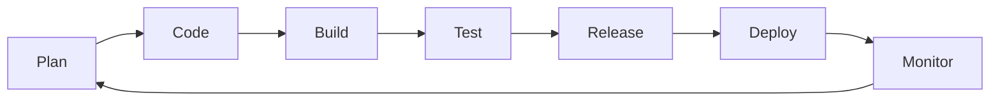
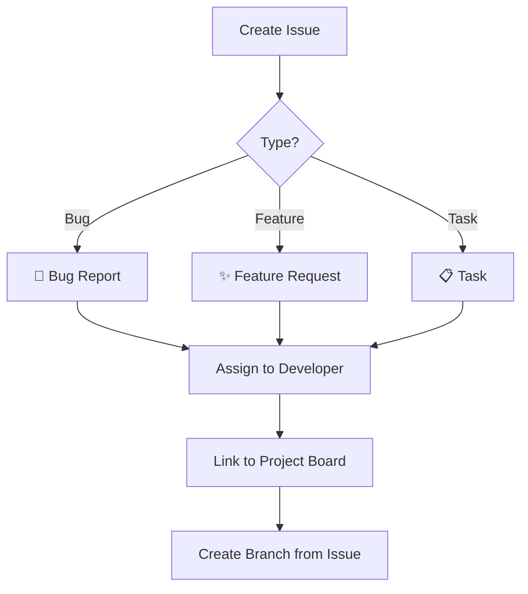
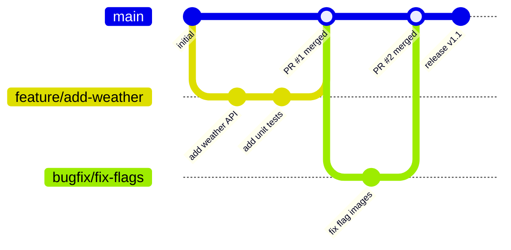
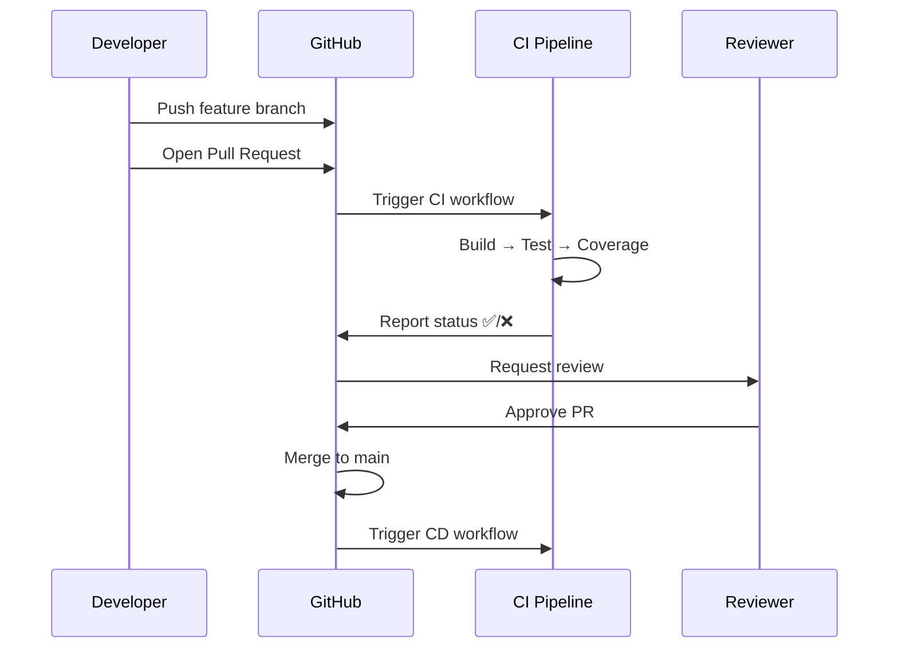
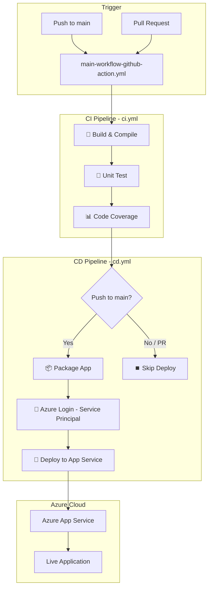
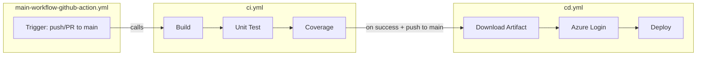
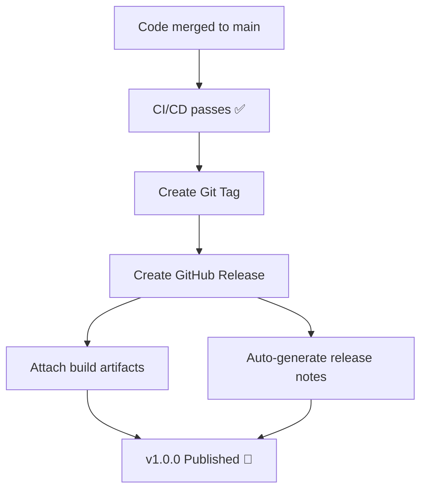
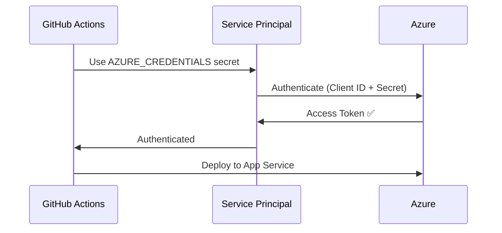

# AZ-2008-May-26-2026


## AZ-2008 DevOps Foundation

A Node.js Express web application that displays live world clocks and weather forecasts for Australia, Thailand, Japan, and India — built as a hands-on project for learning DevOps practices with GitHub and Azure.

---

## About the Project

This is a simple Express.js web app with Bootstrap that:
- Displays real-time clocks for multiple countries
- Fetches 5-day weather forecasts from **Azure Maps API**
- Shows weather icons and a hover popout for detailed forecasts

The real focus of this project is the **DevOps workflow** — how we use GitHub features and automation to build, test, and deliver software.

---

## Quick Setup

```bash
# Clone the repo
git clone https://github.com/msftnutta/AZ-2008-May-26-2026.git
cd AZ-2008-May-26-2026

# Install dependencies
npm install

# Configure environment
cp .env.example .env
# Edit .env and add your Azure Maps key

# Run the app
npm start
```

### Environment Variables

| Variable | Description | How to Get |
|----------|-------------|------------|
| `AZURE_MAPS_KEY` | Azure Maps subscription key | Azure Portal → Create Azure Maps Account → Keys |

> Navigate to [Azure Portal](https://portal.azure.com) → Create a resource → Search "Azure Maps" → Create → Copy Primary Key from the Authentication section.

---

## DevOps Workflow Overview

This project demonstrates a complete DevOps lifecycle using GitHub as the platform.



---

## GitHub Features Used

### 1. Issues — Planning & Tracking

Use **GitHub Issues** to track bugs, features, and tasks.



### 2. Projects — Kanban Board

Use **GitHub Projects** to visualize work in progress.

| Column | Purpose |
|--------|---------|
| 📋 Backlog | New issues waiting to be prioritized |
| 🏗️ In Progress | Currently being worked on |
| 👀 In Review | Pull request submitted, awaiting review |
| ✅ Done | Merged and deployed |

### 3. Branches — Feature Branch Workflow



### 4. Pull Requests — Code Review

Pull Requests are how code gets into `main`:



---

## CI/CD Pipeline Architecture

Our pipeline is split into **CI** (Continuous Integration) and **CD** (Continuous Deployment):



### Pipeline Jobs Breakdown

| Job | Workflow | Purpose |
|-----|----------|---------|
| **Build & Compile** | `ci.yml` | Install deps, verify the app loads correctly |
| **Unit Test** | `ci.yml` | Run Jest tests to catch regressions |
| **Code Coverage** | `ci.yml` | Measure test coverage, upload report |
| **Deploy** | `cd.yml` | Deploy to Azure App Service via Service Principal |

---

## GitHub Actions — Workflow Files

```
.github/workflows/
├── main-workflow-github-action.yml   ← Orchestrator (calls CI then CD)
├── ci.yml                            ← Build → Unit Test → Code Coverage
└── cd.yml                            ← Deploy to Azure App Service
```

### How It Works



---

## Releases & Packages

### Creating a Release

After a successful deployment, create a **GitHub Release** to version your app:



**Steps:**
1. Go to **Releases** → **Draft a new release**
2. Create a new tag (e.g., `v1.0.0`)
3. Auto-generate release notes (GitHub summarizes PRs since last release)
4. Publish release

### GitHub Packages

You can publish your app as an npm package to **GitHub Packages** for reuse:
- Settings → Packages → Connect repository
- Add `publishConfig` to `package.json` pointing to GitHub registry

---

## Setting Up the Service Principal for Deployment

To deploy to Azure, you need a **Service Principal** — an identity that GitHub Actions uses to authenticate with Azure.



**Commands to set up:**

```bash
# 1. Create the Service Principal
az ad sp create-for-rbac --name "github-actions-sp" \
  --role contributor \
  --scopes /subscriptions/<SUBSCRIPTION_ID>/resourceGroups/<RESOURCE_GROUP> \
  --sdk-auth

# 2. Copy the JSON output and add as GitHub Secret: AZURE_CREDENTIALS

# 3. Set app settings on Azure App Service
az webapp config appsettings set \
  --name <APP_NAME> \
  --resource-group <RESOURCE_GROUP> \
  --settings AZURE_MAPS_KEY=<YOUR_KEY>
```

---

## GitHub Secrets Required

| Secret | Purpose |
|--------|---------|
| `AZURE_CREDENTIALS` | Service Principal JSON for Azure login |
| `AZURE_WEBAPP_NAME` | Target App Service name |
| `AZURE_MAPS_KEY` | Azure Maps API key (for tests & app config) |

Add these at: **Repository → Settings → Secrets and variables → Actions**

---

## Running Tests Locally

```bash
# Run tests with coverage
npm test

# Output:
# ✓ should return 200 and serve the HTML page
# ✓ should contain Hello World in the page
# ✓ should return weather data with valid coordinates
# Coverage: 87.5% statements
```

---

## Project Structure

```
├── .github/workflows/       # GitHub Actions CI/CD pipelines
│   ├── main-workflow-github-action.yml
│   ├── ci.yml
│   └── cd.yml
├── public/
│   └── index.html           # Frontend (Bootstrap + live clocks + weather)
├── index.js                 # Express server + Azure Maps weather proxy
├── index.test.js            # Jest unit tests
├── .env                     # Environment variables (not committed)
├── .gitignore               # Ignores node_modules, .env, coverage
├── package.json             # Dependencies and scripts
└── README.md                # This file
```

---

## Learning Outcomes

By working with this project, you will understand:

- ✅ How to use **GitHub Issues** for planning work
- ✅ How to use **GitHub Projects** for tracking progress
- ✅ How to work with **branches** and **pull requests**
- ✅ How to set up **GitHub Actions** for CI/CD automation
- ✅ How to run **unit tests** and measure **code coverage**
- ✅ How to deploy to **Azure App Service** using a **Service Principal**
- ✅ How to manage **releases** and **packages**
- ✅ How to use **status badges** to communicate build health
